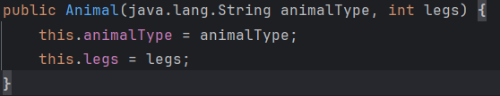
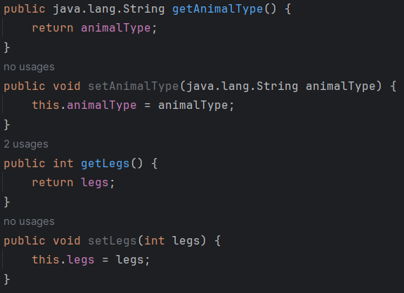
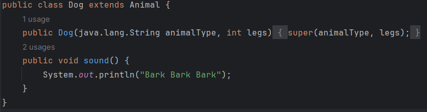
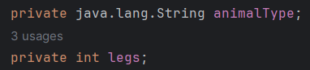
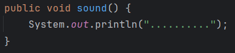

# Lab Assignment OOP Project

## Program involving animal class that showcases the features of OOP

Constructor for Animal class

Getters and setters for the Animal class

The Dog class extends from the Animal class, inheriting its properties, hence making use of the inheritance feature.

animalType and legs properties are made private, only allowed access through the public getter and setter methods, facilitating encapsulation.

The abstract method sound() demonstrates abstraction as well as polymorphism as it is overriden in the Dog class which extends the Animal class, having the same method name returning different outputs when called by different objects.

The program outputs the type of animal (land, water or sky) and the number of legs a dog and fish has/is as well as the sounds they produce following that. They both have separate classes acting as child classes extending from the Animal parent class. The Animal class has the sound() abstract method which by default prints the value "..........". This Dog child class overrides this method by printing "Bark Bark Bark" instead, while the Fish class calls this default method. The driver class outputs all this information by creating new objects based on these classes and getting the properties of the Dog and Fish objects with the getters extended from the animal class. The sound() method is also called, specified also with the object being referred.
